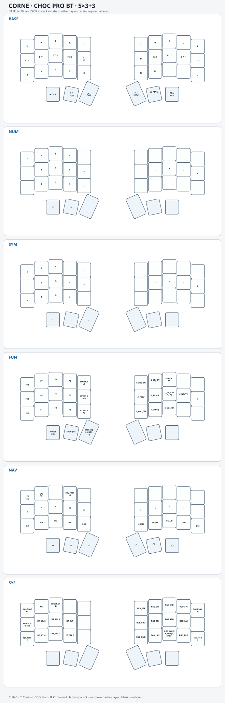
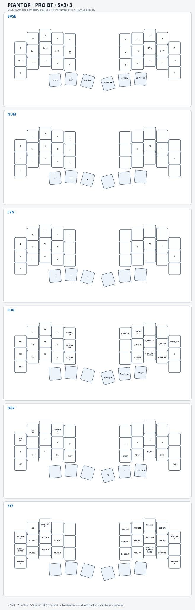

# ZMK firmware for Corne and Piantor

Personal ZMK configurations for two [Keebart](https://www.keebart.com/) Bluetooth split keyboards, both using a 36-key **5×3+3** layout and Sharp Memory-in-Pixel displays.

Both firmwares are based on a custom **QWERTY version of [Miryoku](https://github.com/manna-harbour/miryoku)**, with the layers, behaviors, and display features described below.

`main` is the documentation index. Firmware sources, keymaps, board definitions, and build workflows live on the matching keyboard branch.

## Firmware variants

| Branch | Keyboard | Keymap | Firmware |
| --- | --- | --- | --- |
| [`corne-5col`](https://github.com/StevenKrebs/zmk-config/tree/corne-5col) | Keebart Corne Choc Pro BT, five columns | [`corne_choc_pro_5col.keymap`](https://github.com/StevenKrebs/zmk-config/blob/corne-5col/config/corne_choc_pro_5col.keymap) | [Download ZIP](https://github.com/StevenKrebs/zmk-config/releases/download/corne-5col-v1.0.5/corne-5col-v1.0.5.zip) |
| [`piantor-5col`](https://github.com/StevenKrebs/zmk-config/tree/piantor-5col) | Keebart Piantor Pro BT, five columns | [`piantor_pro_bt_5col.keymap`](https://github.com/StevenKrebs/zmk-config/blob/piantor-5col/config/piantor_pro_bt_5col.keymap) | [Download ZIP](https://github.com/StevenKrebs/zmk-config/releases/download/piantor-5col-v1.0.7/piantor-5col-v1.0.7.zip) |

Each branch retains its own board definitions, physical layout, editor metadata, and firmware targets. Use the firmware for your exact keyboard and half. Both builds use ZMK `v0.3`.

## Keymaps

Each layer is drawn on its keyboard's staggered key geometry, including its thumb cluster. BASE, NUM, and SYM show keyboard legends; other layers retain source aliases, with modifiers displayed as glyphs (`⇧`, `⌃`, `⌥`, `⌘`). `⇧⌥2` is shown as `€`, `⇧⌥8` as `°`, and `C_AC_SEARCH` as **Spotlight**. Functional key glyphs are `⇥` Tab, `⎋` Escape, `␣` Space, `↵` Return, `⌫` Backspace, and `⌦` Delete. The GLOBE key uses Apple’s [Globe key symbol](https://support.apple.com/en-my/102650). BASE dual-action keys show `tap / hold`. Layer-access thumb holds are labeled with the layer they activate: NUM, SYM, FUN, or NAV. `↳` means transparent: it uses the next lower active layer's binding, which may not be BASE. A blank key has no binding on that layer.

Corne · 5-column keymap

Piantor · 5-column keymap

### Corne and Piantor differences

Both maps use the same six layer concepts, but their thumb assignments and several other bindings differ:

| Area | Corne · 5-column | Piantor · 5-column |
| --- | --- | --- |
| BASE thumb taps, left to right | Tab, Esc, Space, Return, Backspace, Delete | Tab, Space, Esc, Backspace, Return, Delete |
| FUN access | Hold Delete (Delete taps) | Hold Esc (Esc taps) |
| Hyper | Hold Esc (Esc taps) | Hold Delete (Delete taps) |
| NUM/SYM right home row | Four positions are transparent and inherit the lower active layer | Explicit right GUI, Alt, Ctrl, and Shift keys occupy those positions |
| FUN thumb shortcuts | Emoji, Caps Logic, and Search occupy the left thumb cluster | Search, Caps Logic, and Emoji occupy the right thumb cluster |
| NAV thumbs | Tab, Hyper, Space, Return, Backspace, and Delete | Left thumb cluster is blank; right cluster has Backspace, Return, and Hyper/Delete |

The Piantor FUN layer also places its screen-lock and media controls differently. The diagrams above show those positions for each board; use the matching diagram and firmware for your keyboard.

## Shared features

### macOS / Windows mode

**OS** is on the **SYS layer at the W position**, immediately left of **Smart Shift**. It switches both the display symbols and the keys sent to the host. It selects how mode-specific keys are interpreted, including the screenshot, emoji, and lock shortcuts, and changes the GLOBE hold behavior. OS mode is saved per Bluetooth profile on the central half and restored after restarts or power loss. Each profile defaults to macOS until changed; flashing a settings-reset image clears these preferences. Mode selection follows the active profile.

- Windows mode swaps Ctrl and GUI/Command, including modifiers inside ordinary key chords. Shift and Alt retain their roles.
- The home-row S/L holds become Windows, while F/J become Ctrl. Letter taps retain their normal meanings.
- Holding G sends Globe on macOS and **Left Ctrl + Left Windows** on Windows. The dedicated Globe binding on NAV follows the same rule. Globe releases match the mode selected when the hold began.
- The widget uses Option/Command symbols on macOS and Alt/Windows symbols on Windows. Windows Alt is the Option bitmap mirrored top to bottom.
- The `fn` indicator appears only in macOS mode. In Windows mode, the Globe-position hold activates the existing Ctrl and Windows indicators together.

These special shortcuts send their complete chord for the selected OS mode:

| Behavior | Location | macOS | Windows |
| --- | --- | --- | --- |
| `screen_full` | FUN + T | Shift + Command + 3 | Windows + Print Screen |
| `screen_area` | FUN + G | Shift + Command + 4 | Alt + Print Screen |
| `screen_adj` | FUN + B | Shift + Command + 5 | Windows + Shift + S |
| `emojis` | FUN, Tab thumb position | Ctrl + Command + Space | Windows + period |
| `screen_lock` | FUN + I | Ctrl + Command + Q | Windows + L |
| `meta` hold (Tab tap) | BASE / NAV, Tab thumb position | Shift + Command | Shift + Ctrl |
| `hyper` hold (Esc tap) | BASE / NAV, Esc thumb position | Ctrl + Alt + Command | Ctrl + Alt |

`screen_area` captures the active window on Windows; `screen_adj` opens Windows region capture. These behaviors retain the selected chord until release and use their mode-specific mapping rather than the general Ctrl/GUI swap for ordinary chords.

### Typing and layers

- Six layers: **BASE, NUM, SYM, FUN, NAV, SYS**, covering typing, numbers, symbols, function/media keys, navigation, and keyboard controls.
- Bilateral home-row hold-tap modifiers (THRM), based on [urob's timeless home-row mods](https://github.com/urob/zmk-config): balanced flavor, 280 ms tapping term, 175 ms quick tap, 150 ms prior-idle requirement, and opposite-hand/thumb hold triggers evaluated on release.
- Thumb taps provide Tab, Esc, Space, Return, Backspace, and Delete. Their holds provide modifier chords or layer access.
- `meta` taps Tab; holding it sends Shift + Command on macOS and Shift + Ctrl on Windows. `hyper` taps Escape; holding it sends Ctrl + Alt + Command on macOS and Ctrl + Alt on Windows.
- Thumb combos toggle NAV (positions 31 + 34) and SYS (32 + 33). Key positions are zero-based.
- **Smart Shift** supports sentence capitalization, punctuation handling, backspace state recovery, and a manual Shift opt-out. Toggle it from SYS; its enabled state is saved on the central half and restored after power cycles.
- **Caps Logic** taps toggle Caps Word; holding sends Caps Lock. The widget tracks logical Caps Word state and locally inferred Caps Lock activity.

### Display, connectivity, and controls

- Sharp MIP status display with layer name, modifier highlights, battery/connection information, and Smart Shift state.
- USB and Bluetooth operation, with five Bluetooth profile selectors on SYS.
- ZMK Studio enabled for the left/central firmware, with a SYS unlock key and USB RPC support.
- SYS controls for bootloader entry, reset, Bluetooth clearing, and RGB underglow settings.
- Underglow starts disabled and turns off during idle. Idle begins after five minutes; deep sleep begins after one hour. The display is configured not to blank merely on idle.

## Build and download

Each firmware workflow builds commits pushed to its matching branch, pull requests, or manual runs. Tag pushes do not start duplicate builds. To build a change, commit and push it to the matching firmware branch. Open [Actions](https://github.com/StevenKrebs/zmk-config/actions) and select the **Build ZMK firmware** run for that branch. The documentation-only `main` branch has no build workflow.

The [Corne v1.0.5 release](https://github.com/StevenKrebs/zmk-config/releases/tag/corne-5col-v1.0.5) and [Piantor v1.0.7 release](https://github.com/StevenKrebs/zmk-config/releases/tag/piantor-5col-v1.0.7) each contain one ZIP with left and right firmware plus separate left and right **settings-reset** images. Choose the matching board and half. Settings-reset images clear stored settings, including per-profile OS mode; they are maintenance images, not the normal keyboard firmware.

Each run also provides the merged `firmware` artifact for test builds without a release.

## Editing

Edit the `.keymap` file and accompanying `.json` metadata on the matching firmware branch. The home-row bindings expose both the hold modifier and tap key, for example `&thrm_left GLOBE G`. The custom shortcut nodes expose `mac-key` and `windows-key` properties for their two chords.

The [keymap editor](https://nickcoutsos.github.io/keymap-editor/) and ZMK Studio have different support for custom behaviors; the branch's source files remain the reference for custom behavior configuration.

Successful builds verify compilation. Device operation, host shortcut settings, and display appearance still require testing on the matching keyboard.
